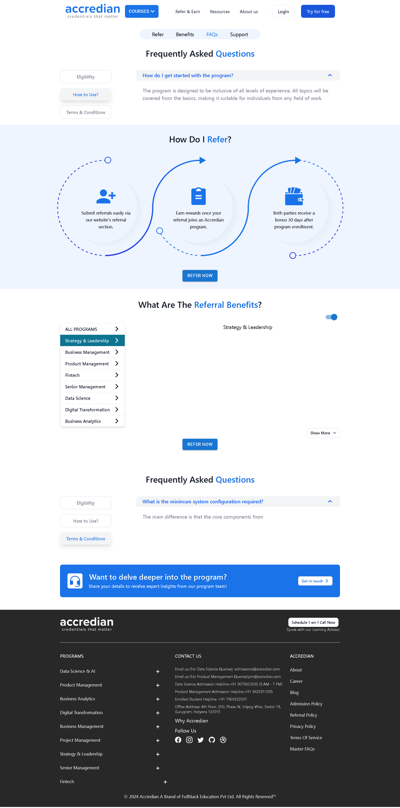

## 🌟 Refer & Earn Frontend

Welcome to the frontend of the Refer & Earn application! This user-friendly interface allows users to easily refer others and earn rewards.

## 🎨 Technologies Used

- **React** - JavaScript library for building user interfaces
- **JavaScript** - Programming language
- **Vite** - Build tool
- **Material-UI (MUI)** - UI components
- **Flowbite** - UI components
- **Tailwind CSS** - Utility-first CSS framework
- **React Router DOM** - For routing

## 📋 Requirements

- Node.js (version >= 14)
- NPM or Yarn package manager
- Modern web browser

## 📦 Setup Instructions

### Prerequisites

- Node.js (version >= 14)
- NPM or Yarn package manager

### Getting Started

1. **Clone the repository**
    ```bash
    git clone https://github.com/iamgaurav12/Accredian-frontend-task.git
    cd Accredian-frontend-task
    ```

2. **Install dependencies**:
    ```bash
    npm install
    ```

3. **Start the development server**:
    ```bash
    npm run dev
    ```

## 📂 Folder Structure

```sh
.
├── src
│   ├── components
│   │   ├── Header.jsx
│   │   ├── Footer.jsx
│   │   └── ...
│   ├── pages
│   │   ├── HomePage.jsx
│   │   ├── ReferPage.jsx
│   │   └── ...
│   ├── styles
│   │   ├── main.css
│   │   └── ...
│   ├── data
│   │   ├── api.js
│   │   └── ...
│   ├── spinner
│   │   ├── Spinner.jsx
│   │   └── ...
│   ├── App.jsx
│   ├── index.css
│   └── main.jsx
├── public
│   ├── home1.png
│   ├── mail.png
│   ├── refer.png
│   ├── home2.png
│   └── ...
├── index.html
├── README.md
├── .env
├── package.json
└── vite.config.js
```

## 🎥 Demo

- Home Page

---
- Refer Notification Mail Page

---
- Refer Page

---
- Dynamic Home Page

---

## 📞 Contact

For any questions or inquiries, please contact:

- **Author**: GAURAV PRAKASH
- **Email**: prakashgaurav189@gmail.com
- **GitHub**: [iamgaurav12](https://github.com/iamgaurav12)

### Notes:

1. **Repository URL**: Make sure to update the repository URL (`https://github.com/iamgaurav12/Accredian-frontend-task`) with the actual URL of your frontend repository.
2. **Environment Variables**: If there are specific environment variables required for the frontend (e.g., API base URL), mention them in the README.
3. **Consistency**: Ensure the names and paths of images in the `public` directory match those in the README.

Feel free to adjust any details to better fit your project’s specific setup and requirements.